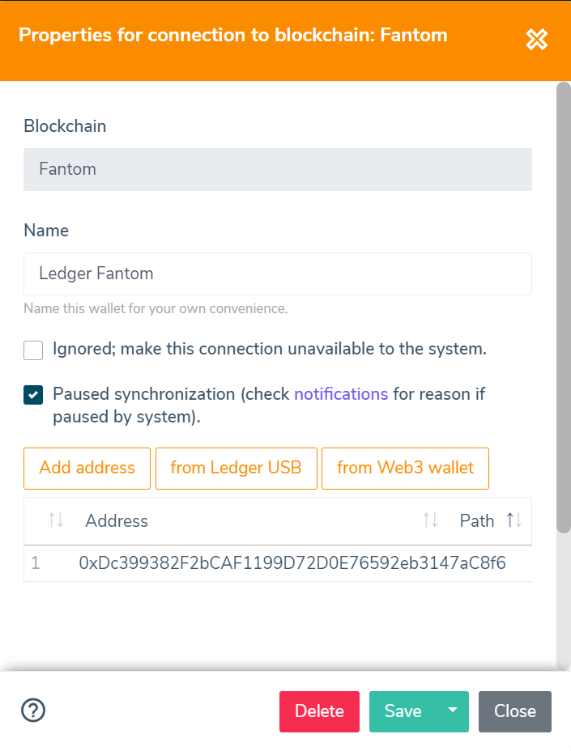

######################
Connections
######################

These pages explain how to set up a connection to a wallet or exchange. Connections are used by the system to synchronize transactions. 

======================
Manage Connections
======================

You can manage connections through the 'Connections' page, available through the side menu. The page will show all previously created connections in a table.
The table shows per connection a number of details, like: Name, Description, Status and last update timestamps. By selecting a row of the table, the connection properties can be altered. 

The following function are available when selecting the drop-down menu on a row:

* **Pause/Unpause** - Quickly toggle the 'Paused' property
* **Jump Queue** - This will move the connection to the front of the queue, ignoring the previously scheduled time. The synchronization will start as soon as possible.
* **Resync** - This will delete all transactions and re-recreate them by doing a full synchronization. This will also **delete user added** data from the related transactions.

======================
Exchange Connection
======================

The properties of an exchange connection are used by the system to retrieve transaction details. Exchanges offer an API (Application Programmers Interface) that can be used to retrieve information.
Most exchanges require a number of private details to shared with our application before the synchronization can start. Our system will automatically enable/disable the required fields.

.. note::
   Some properties are considered sensitive data; these are only shown when the connection is created and are hidden when the connection properties are altered.

The following properties are available for an Exchange Connection:

* **Exchange** - The actual exchange to connect (selectable when new connection is created)
* **Name** - Name you wish to give this connection
* **Key** - API key (see :doc:`exchanges` for more details)
* **Phrase** - API phrase (if applicable, see :doc:`exchanges` for more details)
* **Secret** - API secret (see :doc:`exchanges` for more details)
* **Ignored** - The connection will be ignored by the system (no synchronization and invisible in portfolio)
* **Paused** - The synchronization will not start when scheduled. All transaction data is available normally.

======================
Wallet Connection
======================

A wallet connection is used to retrieve details from a certain blockchain. Each wallet connection has a number of properties that are used by the system to synchronize transactions. 

The following properties are available for an Exchange Connection:

* **Blockchain** - The actual blockchain where the wallet address references to (selectable when new connection is created)
* **Name** - Name you wish to give this connection
* **Address** - Address (single or multiple) that are used by the wallet on the selected blockchain.
* **Active** - The connection will be made unavailable by the system (no synchronization and invisible in portfolio)
* **Paused** - The synchronization will not start when scheduled. All transaction data is available normally.

.. note::
   The address format is checked for a number of blockchains, but you should always make sure you use the correct address to avoid confusing synchronization results.

======================
Status Model
======================

There are a number of different states a connection can be in. The following items explain the possible states:

* **Standby** - Waiting for next background synchronization. The Queue Time column shows the expected time.
* **Queued** - Background synchronization is about to start, the task is waiting to be picked up by our systems.
* **Syncing** - Background sync is being performed, please be patient while we are working on this (no need to keep the application open). Notifications will be created for new transactions. Transactions are visible after synchronization is finished. Some connection types support progress monitoring.
* **Error** - Some occurred during sync, check :doc:`notifications` for the reason. You might need to correct the properties and unpause the connection.
* **Untested** - New or changed connection. The system will automatically validate the entered details with the Exchange. Once tested, synchronization will continue.
* **Paused** - Paused (perhaps due to error); uncheck to make available for synchronization.
* **Inactive** - There was no activity detected within the subscriptions 'Inactivity Period', connection is also Paused. Unpause to restart synchronization.
* **Ignored** - Connection is ignored by the system.

It is possible two states are active at the same time; for example 'paused' and 'error'.

======================
Re-balancing
======================

Re-balancing is activated for a number of different Exchanges and Blockchains. Most of the times this is done due to the fact that the offered API does not offer a complete set of transactions.

The re-balance functionality will calculate any differences per Asset between Exchange/Wallet and unchain.app totals and create transactions with delta value per asset to counter the difference. The transaction type is set to 're-balance' to differentiate these transactions. Note that these transactions can be deleted, since they don't represent an actual transaction on the Exchange or Blockchain.

The re-balance function is activated automatically and is executed after a Exchange or Wallet synchronization. 