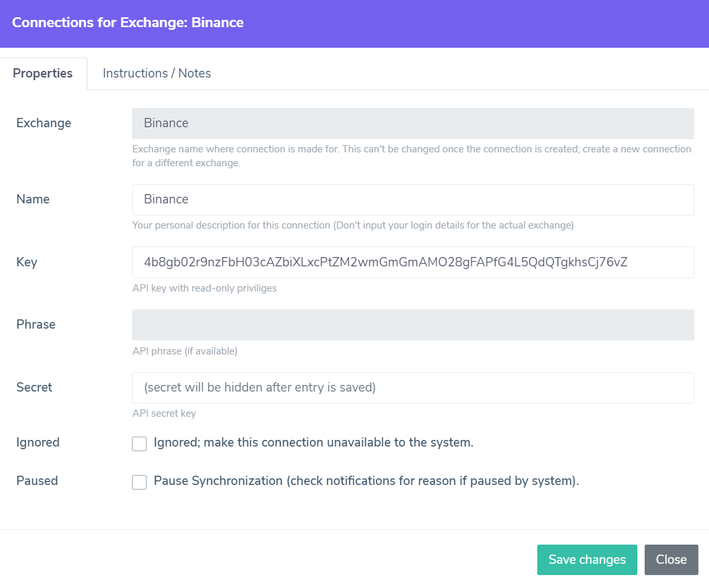
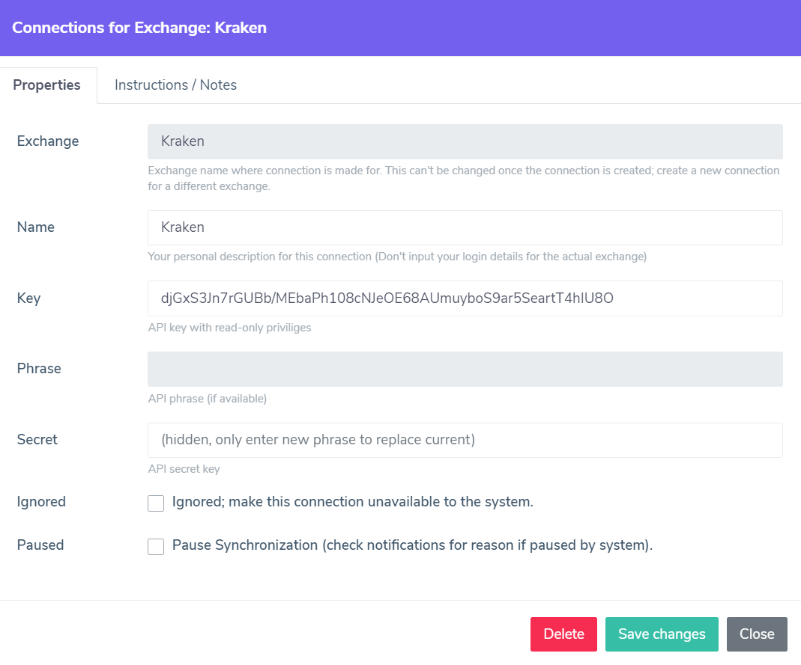

######################
Exchanges
######################

These pages contain details on configuring a new Exchange Connection. Creating new connections is only available in the web application. 

.. note::

   Since we are using multiple servers with unique IP addresses for communication with exchanges; it is currently not possible to use IP address white-listing for any of the exchanges that offer this security measure.

======================
Binance
======================

.. note::
   Binance does not support a complete set of transaction synchronization, but we've managed to support as much as possible on several different available API's that are offered by Binance. 
   To counteract any possible difference between Binance balances and total balance as calculated by unchain.app on all transaction, :doc:`rebalance` is supported. 

You can enter generated keys into the Exchange properties dialog after using the 'New Exchange Connection' button on the 'Connections' page. 

Please following the following steps to generate API keys on Binance and paste them into the unchain.app dialog:

* Login to Binance
* Hover over the account icon and select 'API Management' from the pop-up menu
* Use the 'Create API' button
* Select 'System generated' when requested and click Next
* Enter a label, for example 'unchain app' and click Next (no special characters allowed)
* If requested; solve the captcha puzzle
* If applicable/requested; generate e-mail verification code
* If applicable/requested; enter your 2FA authenticator code and click Next
* Copy the shown 'API key' character string into the 'Key' property field (on unchain.app)
* Select and copy the 'Secret Key' character string into the 'Secret' property field (on unchain.app)
* Make sure the 'API restrictions' are 'Enable reading' only for maximum security (default is probably correct)

On unchain.app Exchange Connection dialog; make sure the keys are copied correctly and a name is given and save the connection.

Binance Interface Comments
--------------------------

* The Binance API does not allow a large number of requests per minute; synchronization will take longer when all trading pairs are synchronized. 
* Our synchronization component detects if no changes are available and will finish quickly.
* :doc:`rebalance` is active and executed at the end of the synchronization cycle to ensure correct asset balances.

======================
BitMEX
======================

Please following the following steps to generate API keys on the BitMEX exchange and paste them into the unchain.app dialog:

* Login to BitMEX as usual.
* Hover over the circle with your initial to show the drop-down menu.
* Select 'API Keys' from the drop-down menu.
* Under the 'Create an API Key' enter a name (for example unchain.app)
* Leave CIDR unchanged (IP address whitelisting is not supported yet)
* Leave 'Key Permissions' to hyphen ('-') for read only access
* Leave 'Withdraw' unchecked for maximum security
* Enter your 2FA code if applicable
* Click on the 'Create API Key' button
* Copy the shown 'ID' character string into the 'Key' property field (on unchain.app)
* Copy the 'Secret' character string into the 'Secret' property field (on unchain.app)

BitMEX Interface Comments
-------------------------

* There is a limit of 1000 transactions, contact us if you encounter this maximum!
* Only transactions denoted with type 'Withdrawal', 'RealisedPNL', 'Deposit' and 'Transfer' are processed.
* Only transactions with status 'Completed' are processed to avoid processing transactions that might become cancelled.

======================
Coinbase
======================

.. note::

   This paragraph is about the Coinbase web application and mobile application and the 'Advanced Trading' interface of Coinbase. For (partially deprecated) Coinbase Pro (Exchange formerly known as GDAX), please see next paragraph. 

The following steps will allow you to create an API key for communication with unchain.app through the Coinbase web application. 

* Login to Coinbase as usual. (make sure to use the official Coinbase site, not Coinbase Pro)
* Click on the user icon in the upper right corner to display a dropdown menu
* Select 'Settings' from the dropdown menu.
* After the settings page has loaded, select the 'API' tab
* Use the 'New API Key' button and enter your 2FA code
* Under the 'Accounts' header in the pop-up dialog, check the 'All wallets' box
* Under the 'Permissions' header, check the following permissions: 'wallet:accounts:read', 'wallet:deposits:read', 'wallet:trades:read', 'wallet:addresses:read', 'wallet:orders:read', 'wallet:transactions:read', 'wallet:withdrawals:read'
* Leave 'Notifications' and 'Security Settings' section unchanged
* Click the 'Create' button to generate keys
* Copy the shown 'API Key' character string into the 'Key' property field (on unchain.app)
* Copy the 'API Secret' character string into the 'Secret' property field (on unchain.app)

======================
Coinbase Pro
======================

.. note::

   For Coinbase (Web App and Mobile App) please see previous paragraph. This paragraph is about the Coinbase Pro Exchange (also known as GDAX) only. 
   Since the release of 'Advanced Trading', not all accounts can access the Coinbase Pro interface anymore. You can still generate an API key to synchronize all trades made prior to migration to 'Advanced Trading'.

The following steps will allow you to create an API key for communication with unchain.app through the Coinbase Pro web application. 

* Login to Coinbase Pro as usual. (make sure to use the official Coinbase Pro Exchange site, not the Coinbase App)
* Click on the user icon in the upper right corner to display a dropdown menu
* Select 'API' from the dropdown menu.
* Use the 'New API Key' button and a pop-up dialog will appear
* Enter a nickname (for example "unchain") in the 'API key nickname' field
* Make sure the 'View' check-box is checked (only)
* Copy the shown 'Passphrase' into the 'Phrose' property field (on unchain.app)
* Leave the 'IP Whitelist' field empty
* Click the 'Create API Key' button
* Enter 2FA code when aske
* Copy the 'API Secret' character string into the 'Secret' property field (on unchain.app)
* Close the dialog with the secret and find the generated API entry in the overview.
* Copy the character string above the 'Nickname' into the 'Key' property field (on unchain.app)

======================
Kraken
======================

Please following the following steps to generate API keys on the Kraken exchange and paste them into the unchain.app dialog:

* Login to Kraken as usual
* On the top corner, click your name for drop-down menu
* Select 'Security' for a sub-menu, and select 'API' menu entry
* Use the 'Add key' link in top of the pane
* Enter a description, for example 'unchain.app'
* Leave the 'Nonce window' value at 0
* Select Permissions: 'Query Funds', 'Query closed orders & trades', 'Query ledger entries' and 'Export Data' (for security, leave other unchecked!)
* Leave other fields empty
* Save using the 'Generate Key' button
* Enter 2FA details if requested/configured
* Copy the shown 'API Key' character string into the 'Key' property field (on unchain.app)
* Copy the 'Private Key' character string into the 'Secret' property field (on unchain.app)

On unchain.app Exchange Connection dialog; make sure the keys are copied correctly and a name is given and save the connection.

.. note::

   Don't share the same API keys from Kraken with another application; since that might interfere with synchronization.

Kraken Interface Comments
-------------------------

* Some currency assets have legacy symbols (like XBT); unchain.app will automatically translate this into the modern symbols to avoid confusion.
* Our system will automatically try to link related transactions (such as trades and fees), although this is not always match 100%.
* Subsequent synchronizations are sped up by saving the last synchronized transaction details. Please allow some additional time for the first (initial) synchronization.

======================
Bybit
======================

Please following the following steps to generate API keys on the Bybit exchange and paste them into the unchain.app dialog:

* Login to Bybit as usual
* Make sure you have 2FA enable, without it you can't create an API key
* Select your user icon in the top corner to show the drop-down menu
* Select 'API' from the drop-down menu
* Click the 'Create New Key' button and enter the fields as followed:
* API key usage: API transaction
* Name for API key: unchain.app (or to your liking)
* API Key Permissions: Read-Only and No IP restriction
* Types: 'Account Transfer' and 'Trade' (only)
* Click 'Submit' button and provide 2FA code
* Copy the shown 'API Key' character string into the 'Key' property field (on unchain.app)
* Copy the shown 'API Secret' character string into the 'Secret' property field (on unchain.app)

.. note::

   The exchange only communicates history up to 2 years old. Older transactions are currently not available through the API of the exchange.

